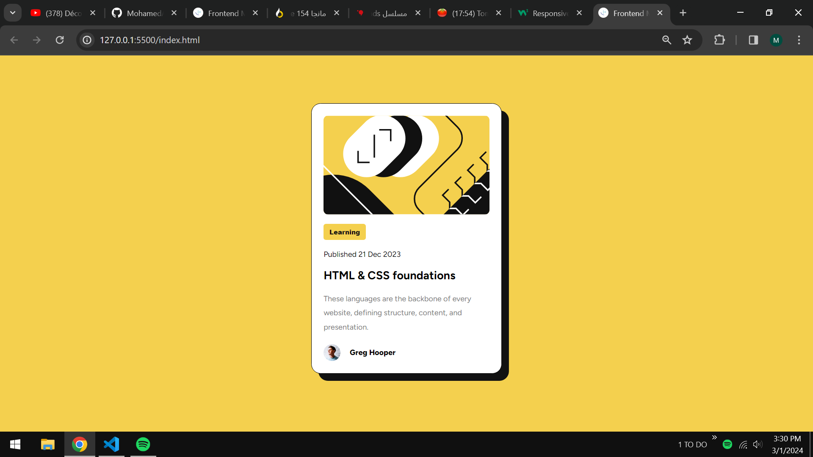
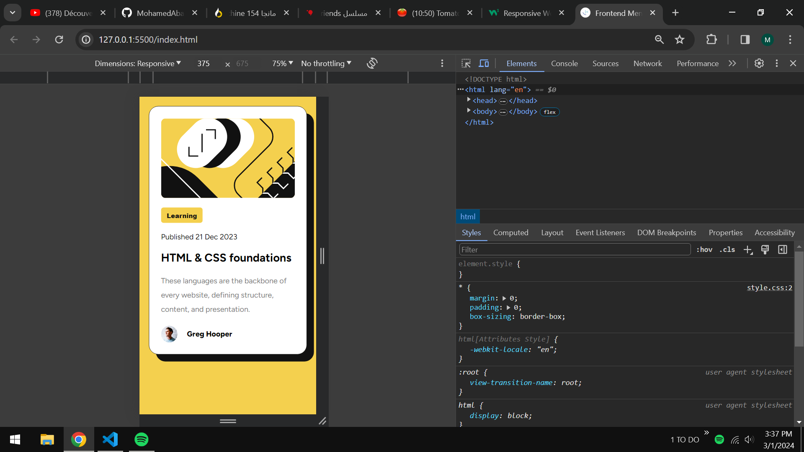

# Frontend Mentor - Blog preview card solution

This is a solution to the [Blog preview card challenge on Frontend Mentor](https://www.frontendmentor.io/challenges/blog-preview-card-ckPaj01IcS). Frontend Mentor challenges help you improve your coding skills by building realistic projects. 

## Table of contents

- [Overview](#overview)
  - [The challenge](#the-challenge)
  - [Screenshot](#screenshot)
  - [Links](#links)
- [Built with](#built-with)
- [Author](#author)

## Overview

### The challenge

Users should be able to:

- See hover and focus states for all interactive elements on the page

### Screenshot

### Links

- Solution URL: [my solustion on frontendmentor](https://www.frontendmentor.io/solutions/responsive-page-containing-a-responsive-card-created-with-html5-and-css3-3dy1nIBptT)
- Live Site URL: [mohamedabakrim.github.io/Blog-preview-card/](https://mohamedabakrim.github.io/Blog-preview-card/)

### Built with

- Semantic HTML5 markup
- CSS custom properties
- Flexbox

## Author

- Website - [Abakrim Mohamed](https://github.com/MohamedAbakrim)
- Frontend Mentor - [@MohamedAbakrim](https://www.frontendmentor.io/profile/MohamedAbakrim)